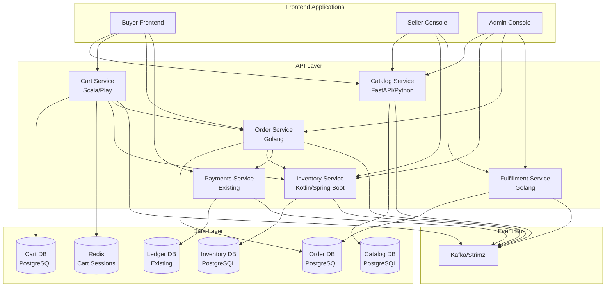
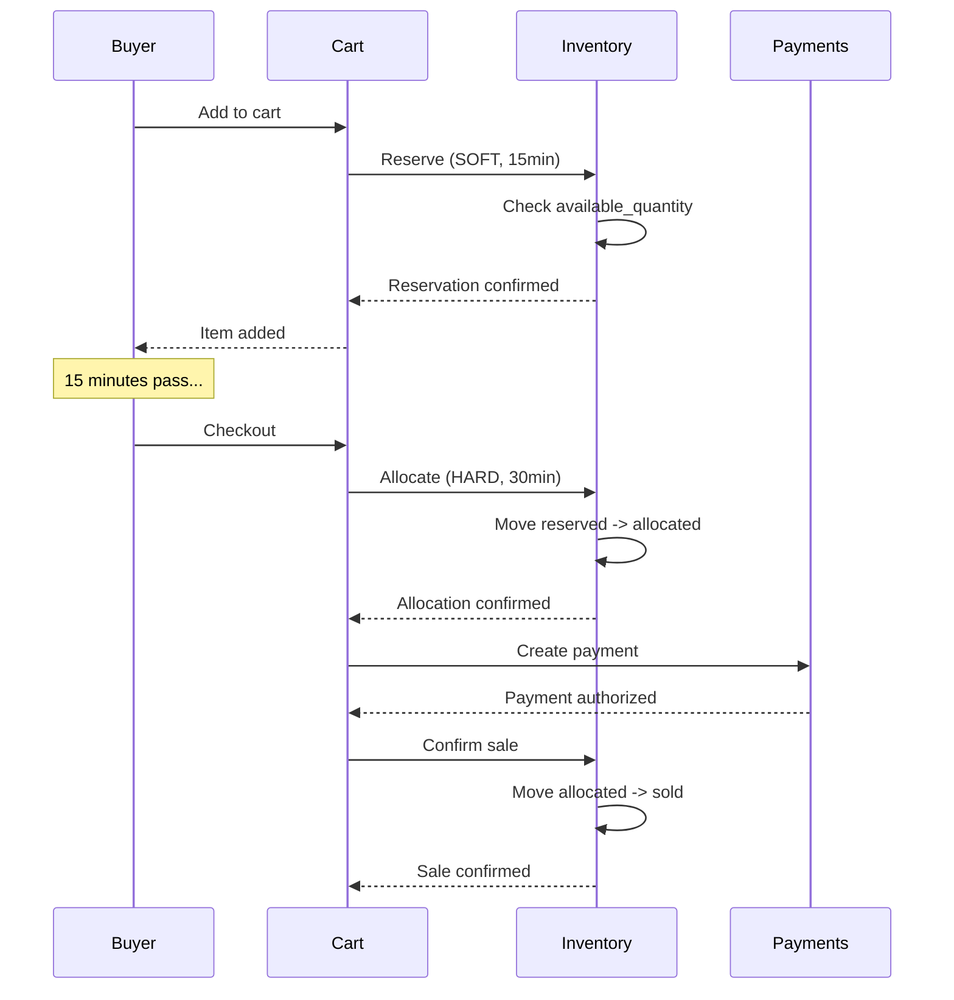
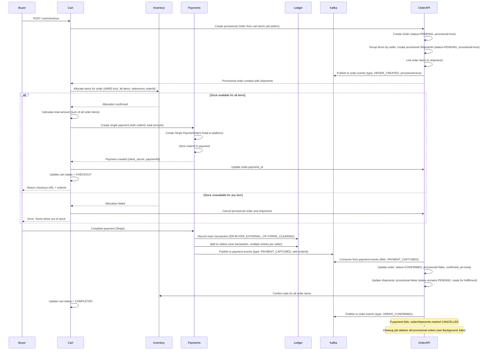

# Catalog and Inventory System Design

## Executive Summary

This design introduces five new services to the BuyIt platform:

1. **Catalog Service** (FastAPI/Python) - Product catalog management and browsing
2. **Inventory Service** (Kotlin/Spring Boot) - Stock tracking and reservation management
3. **Cart Service** (Scala/Play) - Cart management and cart operations
4. **Order Service** (Golang) - Order creation, checkout orchestration, and order lifecycle management
5. **Fulfillment Service** (Golang) - Shipment management and fulfillment tracking

The design also requires updates to the existing **Payments Service** to support Order linking.The design follows existing architectural patterns (event-driven with Kafka, REST APIs, PostgreSQL, Redis) and integrates seamlessly with the payments and ledger services.

**Key Concept: Order Model (Hybrid Approach)**Orders are created from carts during checkout using a **hybrid approach**:

- **Provisional Orders**: Created before payment (status = PENDING, provisional = true) to enable inventory allocation and payment linking
- **Confirmed Orders**: After payment success, orders become confirmed (status = CONFIRMED, provisional = false)
- **Cleanup**: Provisional orders that fail or are abandoned are cleaned up by background jobs

**One order can contain items from multiple sellers**, and **one payment is made for the entire order**. The platform internally splits the payment to sellers via ledger transactions. This design provides:

- **Single Order**: One order per checkout (even with multiple sellers)
- **Single Payment**: Buyer makes one payment to platform
- **Internal Split**: Platform splits payment to sellers via ledger (after payment success)
- **Fulfillment Separation**: Shipments/FulfillmentGroups handle per-seller fulfillment (one per seller within an order)
- Clear purchase record for buyers
- Simplified checkout experience (one payment, one order)

## Architecture Overview




## Service Design

### 1. Catalog Service (FastAPI/Python)

**Responsibilities:**

- Product CRUD operations (sellers manage their products)
- Product browsing and listing (buyers view products)
- Category management
- Product search (basic SQL-based, extensible to Elasticsearch)
- Product attributes and variants
- Media management (CloudFlare Images integration)

**Technology Rationale:**

- **FastAPI**: High performance, async support, automatic OpenAPI docs, Python ecosystem
- **Python**: Future ML/recommendation integration, rich data science libraries
- **PostgreSQL**: Consistent with existing stack, JSONB for flexible attributes

**Key Design Decisions:**

1. **Read-Heavy Service**: Optimized for browsing (caching layer recommended for production)
2. **Seller Isolation**: Products scoped by `sellerId` (fetched from Payments Service using Auth0 user_id)
3. **Extensible Schema**: JSONB fields for future attributes without migrations
4. **Soft Deletes**: Products marked as deleted, not removed (for order history)

**Database Schema:**

```sql
-- Products table
CREATE TABLE products (
    id UUID PRIMARY KEY DEFAULT gen_random_uuid(),
    seller_id TEXT NOT NULL,  -- From Auth0 token
    sku TEXT NOT NULL,
    name TEXT NOT NULL,
    description TEXT,
    category_id UUID REFERENCES categories(id),
    price_cents BIGINT NOT NULL CHECK (price_cents > 0),
    currency TEXT NOT NULL CHECK (currency ~ '^[A-Z]{3}$'),
    status TEXT NOT NULL DEFAULT 'DRAFT' CHECK (status IN ('DRAFT', 'ACTIVE', 'INACTIVE', 'DELETED')),
    attributes JSONB,  -- Flexible: {"color": "red", "size": "L", "material": "cotton"}
    images JSONB,  -- Array of CloudFlare Image IDs: ["cf-image-id-1", "cf-image-id-2"]
    created_at TIMESTAMPTZ NOT NULL DEFAULT now(),
    updated_at TIMESTAMPTZ NOT NULL DEFAULT now(),
    deleted_at TIMESTAMPTZ,
    
    UNIQUE(seller_id, sku),  -- SKU unique per seller
    INDEX idx_seller_status (seller_id, status),
    INDEX idx_category (category_id),
    INDEX idx_status (status) WHERE deleted_at IS NULL
);

-- Categories table (simple now, hierarchical later)
CREATE TABLE categories (
    id UUID PRIMARY KEY DEFAULT gen_random_uuid(),
    name TEXT NOT NULL,
    slug TEXT NOT NULL UNIQUE,
    description TEXT,
    parent_id UUID REFERENCES categories(id),  -- For future hierarchy
    created_at TIMESTAMPTZ NOT NULL DEFAULT now(),
    
    INDEX idx_parent (parent_id)
);

-- Product variants (for future: size, color, etc.)
CREATE TABLE product_variants (
    id UUID PRIMARY KEY DEFAULT gen_random_uuid(),
    product_id UUID NOT NULL REFERENCES products(id) ON DELETE CASCADE,
    sku TEXT NOT NULL,
    variant_attributes JSONB,  -- {"size": "L", "color": "red"}
    price_cents BIGINT,  -- Override base price if different
    created_at TIMESTAMPTZ NOT NULL DEFAULT now(),
    
    UNIQUE(product_id, sku)
);
```

**API Endpoints:**

```python
# Seller endpoints (require accountType: SELLER)
POST   /api/catalog/products              # Create product
GET    /api/catalog/products              # List seller's products
GET    /api/catalog/products/{id}         # Get product details
PUT    /api/catalog/products/{id}         # Update product
DELETE /api/catalog/products/{id}         # Soft delete product

# Buyer endpoints (public or require accountType: BUYER)
GET    /api/catalog/products/browse       # Browse products (paginated, filtered)
GET    /api/catalog/products/{id}         # Get product details (public)
GET    /api/catalog/categories            # List categories
GET    /api/catalog/search?q=...          # Search products (basic SQL, extensible)

# Admin endpoints (require accountType: ADMIN)
GET    /api/catalog/products/all          # List all products (admin)
PUT    /api/catalog/products/{id}/status  # Change product status
```

**Key Features:**

- **Auth0 Integration**: Extract `user_id`, `email`, and `accountType` from JWT token
- **Seller ID Resolution**: Fetch `sellerId` from Payments Service using Auth0 `user_id` or `email` (sellerId = email in payments service)
- **CloudFlare Images**: Upload and manage product images via CloudFlare Images API
- **Pagination**: Cursor-based pagination for large result sets
- **Filtering**: By category, price range, seller (for admin)
- **Caching Strategy**: Redis for hot products (future enhancement)

**CloudFlare Images Integration:**

- Upload images via CloudFlare Images API on product creation/update
- Store CloudFlare image IDs in `images` JSONB field
- Serve images via CloudFlare CDN URLs (generated from image IDs)
- Support image variants (thumbnails, full-size) via CloudFlare transformations

### 2. Inventory Service (Kotlin/Spring Boot)

**Responsibilities:**

- Stock level tracking (available, reserved, allocated)
- Inventory reservations (soft and hard locks)
- Stock updates (increment/decrement)
- Low stock alerts
- Inventory reconciliation

**Technology Rationale:**

- **Kotlin/Spring Boot**: Consistency with payments/ledger services, strong typing, JVM ecosystem
- **PostgreSQL**: SERIALIZABLE isolation for inventory correctness (similar to ledger)
- **Kafka**: Event-driven stock updates and alerts

**Key Design Decisions:**

1. **Inventory Locking Strategy** (Best Practice):

- **Soft Reservation**: On add-to-cart (15min TTL, can be overridden if stock available)
- **Hard Lock**: On checkout initiation (until payment completes/fails)
- **Release Mechanisms**: Timeout, checkout completion, checkout failure, cart abandonment

2. **Stock Levels**:

- `available`: Available for purchase
- `reserved`: Soft-reserved in carts (can be reclaimed)
- `allocated`: Hard-locked for checkout (cannot be reclaimed until timeout)
- `sold`: Permanently allocated (after payment confirmation)

3. **Concurrency Control**: SERIALIZABLE isolation for stock updates (prevents overselling)

**Database Schema:**

```sql
-- Inventory table
CREATE TABLE inventory (
    id UUID PRIMARY KEY DEFAULT gen_random_uuid(),
    product_id UUID NOT NULL,  -- References catalog service (eventual consistency)
    seller_id TEXT NOT NULL,
    sku TEXT NOT NULL,
    available_quantity INT NOT NULL DEFAULT 0 CHECK (available_quantity >= 0),
    reserved_quantity INT NOT NULL DEFAULT 0 CHECK (reserved_quantity >= 0),
    allocated_quantity INT NOT NULL DEFAULT 0 CHECK (allocated_quantity >= 0),
    total_quantity INT NOT NULL CHECK (total_quantity >= 0),
    low_stock_threshold INT DEFAULT 10,
    created_at TIMESTAMPTZ NOT NULL DEFAULT now(),
    updated_at TIMESTAMPTZ NOT NULL DEFAULT now(),
    
    UNIQUE(seller_id, sku),
    INDEX idx_product (product_id),
    INDEX idx_seller_sku (seller_id, sku),
    CHECK (available_quantity + reserved_quantity + allocated_quantity <= total_quantity)
);

-- Inventory reservations (soft locks)
CREATE TABLE inventory_reservations (
    id UUID PRIMARY KEY DEFAULT gen_random_uuid(),
    inventory_id UUID NOT NULL REFERENCES inventory(id),
    cart_id UUID NOT NULL,  -- References shopping cart
    quantity INT NOT NULL CHECK (quantity > 0),
    reservation_type TEXT NOT NULL CHECK (reservation_type IN ('SOFT', 'HARD')),
    expires_at TIMESTAMPTZ NOT NULL,  -- 15min for SOFT, longer for HARD
    created_at TIMESTAMPTZ NOT NULL DEFAULT now(),
    
    INDEX idx_cart (cart_id),
    INDEX idx_expires (expires_at),
    INDEX idx_inventory (inventory_id)
);

-- Inventory transactions (audit trail)
CREATE TABLE inventory_transactions (
    id UUID PRIMARY KEY DEFAULT gen_random_uuid(),
    inventory_id UUID NOT NULL REFERENCES inventory(id),
    transaction_type TEXT NOT NULL CHECK (transaction_type IN (
        'STOCK_ADD', 'STOCK_REMOVE', 'RESERVE', 'ALLOCATE', 'RELEASE', 'SELL'
    )),
    quantity INT NOT NULL,
    reference_id UUID,  -- cart_id, order_id, etc.
    description TEXT,
    created_at TIMESTAMPTZ NOT NULL DEFAULT now(),
    
    INDEX idx_inventory (inventory_id),
    INDEX idx_reference (reference_id)
);
```

**API Endpoints:**

```kotlin
// Internal endpoints (called by Cart Service)
POST   /api/inventory/reserve          # Soft reserve (add-to-cart)
POST   /api/inventory/allocate          # Hard lock (checkout)
POST   /api/inventory/release           # Release reservation
POST   /api/inventory/confirm-sale      # Confirm sale (after payment)

// Seller endpoints
GET    /api/inventory/stock/{sku}       # Get stock level
PUT    /api/inventory/stock/{sku}       # Update stock (add/remove)
GET    /api/inventory/low-stock         # Get low stock alerts

// Buyer endpoints (public)
GET    /api/inventory/availability/{productId}  # Check availability
```

**Inventory Locking Flow:**



**Key Invariants:**

1. `available_quantity + reserved_quantity + allocated_quantity <= total_quantity` (enforced by DB constraint)
2. Reservations expire after TTL (background job cleans up)
3. Stock updates use SERIALIZABLE isolation (prevents race conditions)
4. All stock changes are audited (inventory_transactions table)

### 3. Cart Service (Scala/Play)

**Responsibilities:**

- Cart CRUD operations (add, update, remove items)
- Cart expiration management (TTL-based)
- Inventory soft reservations (add-to-cart)
- Cart abandonment tracking
- **Does NOT handle checkout orchestration** (delegated to Order Service)

**Technology Rationale:**

- **Scala/Play**: Consistency with User service, functional programming benefits
- **PostgreSQL**: Cart persistence, long-term storage
- **Redis**: Cart session storage (fast access, TTL support)
- **Kafka**: Cart events (abandonment, checkout initiation)

**Service Interactions:**

- **Cart → Order Service**: On checkout, calls Order Service to create provisional order
- **Cart → Inventory Service**: Manages soft reservations (add-to-cart)
- **Cart → Kafka**: Publishes cart events (CartCreatedEvent, CartItemAddedEvent, CartAbandonedEvent)

**Key Design Decisions:**

1. **Dual Storage Strategy**:

                                                                                                                                                                                                                                                                                                                                                                                                                                                                                                                                                                                                                                                                                                                                                                                                                                                                                                                                                                                                                                                                                                                                                                                                                                                                                                                                                                                                                                                                                                                                                                                                                                                                                                                                                                                                                                                                                                                                                                                                                                                                                                                                                                                                                                                                                                                                                                                                                                                                                                                                                                                                                                                                                                                                                                                                                                                                                                                                                                                                                                                                                                                                                                                                - **Redis**: Hot cart data (active carts, TTL-based expiration)
                                                                                                                                                                                                                                                                                                                                                                                                                                                                                                                                                                                                                                                                                                                                                                                                                                                                                                                                                                                                                                                                                                                                                                                                                                                                                                                                                                                                                                                                                                                                                                                                                                                                                                                                                                                                                                                                                                                                                                                                                                                                                                                                                                                                                                                                                                                                                                                                                                                                                                                                                                                                                                                                                                                                                                                                                                                                                                                                                                                                                                                                                                                                                                                                - **PostgreSQL**: Persistent cart history (completed, abandoned carts for analytics)

2. **Cart Session Management**:

                                                                                                                                                                                                                                                                                                                                                                                                                                                                                                                                                                                                                                                                                                                                                                                                                                                                                                                                                                                                                                                                                                                                                                                                                                                                                                                                                                                                                                                                                                                                                                                                                                                                                                                                                                                                                                                                                                                                                                                                                                                                                                                                                                                                                                                                                                                                                                                                                                                                                                                                                                                                                                                                                                                                                                                                                                                                                                                                                                                                                                                                                                                                                                                                - Active carts stored in Redis with 15min TTL
                                                                                                                                                                                                                                                                                                                                                                                                                                                                                                                                                                                                                                                                                                                                                                                                                                                                                                                                                                                                                                                                                                                                                                                                                                                                                                                                                                                                                                                                                                                                                                                                                                                                                                                                                                                                                                                                                                                                                                                                                                                                                                                                                                                                                                                                                                                                                                                                                                                                                                                                                                                                                                                                                                                                                                                                                                                                                                                                                                                                                                                                                                                                                                                                - Cart updates extend TTL automatically
                                                                                                                                                                                                                                                                                                                                                                                                                                                                                                                                                                                                                                                                                                                                                                                                                                                                                                                                                                                                                                                                                                                                                                                                                                                                                                                                                                                                                                                                                                                                                                                                                                                                                                                                                                                                                                                                                                                                                                                                                                                                                                                                                                                                                                                                                                                                                                                                                                                                                                                                                                                                                                                                                                                                                                                                                                                                                                                                                                                                                                                                                                                                                                                                - On checkout, cart moved to PostgreSQL for persistence

3. **Performance Optimization**:

                                                                                                                                                                                                                                                                                                                                                                                                                                                                                                                                                                                                                                                                                                                                                                                                                                                                                                                                                                                                                                                                                                                                                                                                                                                                                                                                                                                                                                                                                                                                                                                                                                                                                                                                                                                                                                                                                                                                                                                                                                                                                                                                                                                                                                                                                                                                                                                                                                                                                                                                                                                                                                                                                                                                                                                                                                                                                                                                                                                                                                                                                                                                                                                                - Redis provides sub-millisecond cart reads
                                                                                                                                                                                                                                                                                                                                                                                                                                                                                                                                                                                                                                                                                                                                                                                                                                                                                                                                                                                                                                                                                                                                                                                                                                                                                                                                                                                                                                                                                                                                                                                                                                                                                                                                                                                                                                                                                                                                                                                                                                                                                                                                                                                                                                                                                                                                                                                                                                                                                                                                                                                                                                                                                                                                                                                                                                                                                                                                                                                                                                                                                                                                                                                                - Reduces PostgreSQL load for high-frequency cart operations

**Storage Strategy:Redis Schema (Active Carts):**

```javascript
Key: cart:{buyer_id}
Value: JSON {
  "cartId": "uuid",
  "buyerId": "buyer_123",
  "status": "ACTIVE",
  "items": [
    {
      "itemId": "uuid",
      "productId": "uuid",
      "sku": "SKU-123",
      "sellerId": "seller_456",
      "quantity": 2,
      "priceCents": 5000,
      "currency": "USD",
      "reservationId": "uuid"
    }
  ],
  "createdAt": "2024-01-15T10:30:00Z",
  "updatedAt": "2024-01-15T10:35:00Z",
  "expiresAt": "2024-01-15T10:50:00Z"
}
TTL: 15 minutes (auto-extended on updates)
```

**PostgreSQL Schema (Cart History):**

```sql
-- Shopping carts (persistent storage for completed/abandoned carts)
CREATE TABLE carts (
    id UUID PRIMARY KEY DEFAULT gen_random_uuid(),
    buyer_id TEXT NOT NULL,  -- From Auth0 token (user_id)
    status TEXT NOT NULL CHECK (status IN ('CHECKOUT', 'COMPLETED', 'ABANDONED', 'EXPIRED')),
    created_at TIMESTAMPTZ NOT NULL DEFAULT now(),
    updated_at TIMESTAMPTZ NOT NULL DEFAULT now(),
    completed_at TIMESTAMPTZ,
    
    INDEX idx_buyer (buyer_id),
    INDEX idx_status (status),
    INDEX idx_completed (completed_at)
);

-- Cart items (snapshot at checkout/completion)
CREATE TABLE cart_items (
    id UUID PRIMARY KEY DEFAULT gen_random_uuid(),
    cart_id UUID NOT NULL REFERENCES carts(id) ON DELETE CASCADE,
    product_id UUID NOT NULL,
    sku TEXT NOT NULL,
    seller_id TEXT NOT NULL,
    quantity INT NOT NULL CHECK (quantity > 0),
    price_cents BIGINT NOT NULL,
    currency TEXT NOT NULL,
    reservation_id UUID,  -- References inventory_reservations
    created_at TIMESTAMPTZ NOT NULL DEFAULT now(),
    
    INDEX idx_cart (cart_id),
    INDEX idx_reservation (reservation_id)
);

-- Orders (created from cart during checkout)
-- Note: ONE order per checkout, can contain items from multiple sellers
-- ONE payment for the entire order, split internally to sellers via ledger
-- Hybrid Approach: Orders created before payment as "provisional", confirmed after payment
CREATE TABLE orders (
    id UUID PRIMARY KEY DEFAULT gen_random_uuid(),
    cart_id UUID NOT NULL REFERENCES carts(id),
    buyer_id TEXT NOT NULL,  -- From Auth0 token (user_id)
    status TEXT NOT NULL DEFAULT 'PENDING' CHECK (status IN (
        'PENDING',      -- Order created, awaiting payment (provisional)
        'CONFIRMED',    -- Payment successful, order confirmed (provisional = false)
        'PROCESSING',   -- Order being prepared (at least one shipment processing)
        'SHIPPED',      -- All shipments shipped
        'DELIVERED',    -- All shipments delivered
        'CANCELLED',    -- Order cancelled (payment failed or manual cancellation)
        'REFUNDED'      -- Order refunded (can transition from DELIVERED)
    )),
    provisional BOOLEAN NOT NULL DEFAULT true,  -- True until payment confirmed, then false
    total_amount_cents BIGINT NOT NULL CHECK (total_amount_cents > 0),
    currency TEXT NOT NULL CHECK (currency ~ '^[A-Z]{3}$'),
    payment_id UUID,  -- References payment (nullable until payment created)
    created_at TIMESTAMPTZ NOT NULL DEFAULT now(),
    updated_at TIMESTAMPTZ NOT NULL DEFAULT now(),
    confirmed_at TIMESTAMPTZ,  -- When payment confirmed (provisional = false)
    cancelled_at TIMESTAMPTZ,
    
    INDEX idx_buyer (buyer_id),
    INDEX idx_status (status),
    INDEX idx_cart (cart_id),
    INDEX idx_payment (payment_id),
    INDEX idx_provisional (provisional, created_at)  -- For cleanup job
);

-- Shipments (fulfillment units, one per seller within an order)
-- Handles per-seller fulfillment, shipping, and tracking
-- Hybrid Approach: Shipments created before payment as "provisional", confirmed after payment
CREATE TABLE shipments (
    id UUID PRIMARY KEY DEFAULT gen_random_uuid(),
    order_id UUID NOT NULL REFERENCES orders(id) ON DELETE CASCADE,
    seller_id TEXT NOT NULL,  -- Seller responsible for this shipment
    status TEXT NOT NULL DEFAULT 'PENDING' CHECK (status IN (
        'PENDING',      -- Awaiting payment confirmation (provisional)
        'PROCESSING',   -- Seller preparing shipment
        'SHIPPED',      -- Shipment shipped (tracking number added)
        'DELIVERED',    -- Shipment delivered
        'CANCELLED'     -- Shipment cancelled
    )),
    provisional BOOLEAN NOT NULL DEFAULT true,  -- True until payment confirmed, then false
    tracking_number TEXT,
    carrier TEXT,  -- Shipping carrier (e.g., 'UPS', 'FedEx')
    shipped_at TIMESTAMPTZ,
    delivered_at TIMESTAMPTZ,
    created_at TIMESTAMPTZ NOT NULL DEFAULT now(),
    updated_at TIMESTAMPTZ NOT NULL DEFAULT now(),
    
    INDEX idx_order (order_id),
    INDEX idx_seller (seller_id),
    INDEX idx_status (status),
    INDEX idx_provisional (provisional, created_at),  -- For cleanup job
    UNIQUE(order_id, seller_id)  -- One shipment per seller per order
);

-- Order items (snapshot of cart items at checkout)
-- Can contain items from multiple sellers (seller_id per item)
CREATE TABLE order_items (
    id UUID PRIMARY KEY DEFAULT gen_random_uuid(),
    order_id UUID NOT NULL REFERENCES orders(id) ON DELETE CASCADE,
    shipment_id UUID REFERENCES shipments(id),  -- Links item to shipment (for fulfillment)
    product_id UUID NOT NULL,
    sku TEXT NOT NULL,
    seller_id TEXT NOT NULL,  -- Seller for this item
    quantity INT NOT NULL CHECK (quantity > 0),
    unit_price_cents BIGINT NOT NULL CHECK (unit_price_cents > 0),
    total_price_cents BIGINT NOT NULL CHECK (total_price_cents > 0),
    currency TEXT NOT NULL CHECK (currency ~ '^[A-Z]{3}$'),
    reservation_id UUID,  -- References inventory_reservations
    created_at TIMESTAMPTZ NOT NULL DEFAULT now(),
    
    INDEX idx_order (order_id),
    INDEX idx_shipment (shipment_id),
    INDEX idx_seller (seller_id),
    INDEX idx_reservation (reservation_id),
    CHECK (total_price_cents = unit_price_cents * quantity)
);
```

**API Endpoints:**

```scala
// Buyer endpoints
GET    /api/cart                          # Get current cart (from Redis)
POST   /api/cart/items                    # Add item to cart (Redis + extend TTL)
PUT    /api/cart/items/{itemId}            # Update item quantity (Redis + extend TTL)
DELETE /api/cart/items/{itemId}           # Remove item (Redis + extend TTL)
POST   /api/cart/checkout                 # Initiate checkout (calls Order Service internally)
GET    /api/cart/history                  # Cart history (from PostgreSQL)
```

**Cart Operations Flow:**

1. **Get Cart**: Check Redis first, if not found create new cart in Redis
2. **Add/Update/Remove Item**: Update Redis, extend TTL, sync reservation with Inventory Service (soft reservation)
3. **Checkout** (Hybrid Approach - Provisional Orders):

        **Cart Service:**
        - Move cart from Redis to PostgreSQL (status = CHECKOUT)
        - Call Order Service (internal API) to create provisional order
        
        **Order Service:**
        - Create ONE provisional Order (status = PENDING, provisional = true) with all cart items
        - Group order items by seller, create provisional Shipments (status = PENDING, provisional = true, one per seller)
        - Link order items to shipments
        - Call Inventory Service: Allocate inventory for all items (hard lock, references orderId)
        - If allocation succeeds:
            - Call Payments Service: Create ONE payment (total amount, with orderId)
            - Return { orderId, paymentId, clientSecret } to Cart Service
        - If allocation fails:
            - Cancel provisional order and shipments
            - Return error to Cart Service
        
        **Cart Service:**
        - Return checkout URL to buyer
        
        **Payment Success (Order Service consumes payment.events):**
        - Update order: status = CONFIRMED, provisional = false, confirmed_at = now()
        - Update all shipments: provisional = false (status remains PENDING, ready for fulfillment)
        - Call Inventory Service: Confirm sale for all order items
        - Update cart status = COMPLETED (via Cart Service API or event)
        - Publish OrderConfirmedEvent to Kafka
        
        **Payment Failure (Order Service consumes payment.events):**
        - Update order: status = CANCELLED, cancelled_at = now()
        - Update all shipments: status = CANCELLED
        - Call Inventory Service: Release inventory for all items
        - Update cart status = ABANDONED (via Cart Service API or event)
        - Note: Provisional orders/shipments can be deleted by cleanup job (see Background Jobs)

4. **Cart Expiration**: Redis TTL automatically expires, background job moves to PostgreSQL (status = EXPIRED)

**Service Interaction Summary:**

- **Cart ↔ Order**: Cart Service calls Order Service to create orders during checkout
- **Order ↔ Inventory**: Order Service allocates/confirms inventory
- **Order ↔ Payments**: Order Service creates payment, consumes payment events
- **Order ↔ Fulfillment**: Order Service creates shipments, Fulfillment Service manages shipment lifecycle
- **Fulfillment → Order**: Shipment status updates trigger order status aggregation

**Multi-Seller Order Handling:**If a cart contains items from multiple sellers:

- **Single Order**: ONE order contains all items (from all sellers)
- **Single Payment**: Buyer makes ONE payment to the platform for the total amount
- **Internal Split**: Platform splits payment to sellers via ledger (after payment success)
- **Shipments**: One shipment per seller within the order (for fulfillment)
- **Cart Completion**: Cart marked as COMPLETED when payment succeeds and order is CONFIRMED
- **Payment Failure**: If payment fails, order is CANCELLED

**Example:**

```javascript
Cart with items:
    - Item A (Seller 1): $50
    - Item B (Seller 1): $30
    - Item C (Seller 2): $20
  Total: $100

Checkout creates:
    - Order 1: $100 (contains all items)
        - OrderItem 1 (Seller 1): $50
        - OrderItem 2 (Seller 1): $30
        - OrderItem 3 (Seller 2): $20
    - Shipment 1 (Seller 1): Contains OrderItem 1, 2
    - Shipment 2 (Seller 2): Contains OrderItem 3
    - Payment 1: $100 (to platform)

On payment success:
    - Ledger records single transaction with multiple entries:
        - DR BUYER_EXTERNAL $100
        - CR STRIPE_CLEARING $100
        - DR STRIPE_CLEARING $80 (Seller 1 total)
            - CR SELLER_PAYABLE (Seller 1) $72 (90% after 10% platform fee)
            - CR BUYIT_REVENUE $8 (10% platform fee)
        - DR STRIPE_CLEARING $20 (Seller 2 total)
            - CR SELLER_PAYABLE (Seller 2) $18 (90% after 10% platform fee)
            - CR BUYIT_REVENUE $2 (10% platform fee)
```

**Why This Design Works (Hybrid Approach):**This uses a **hybrid approach** that combines the benefits of both pre-payment and post-payment order creation:

1. **Provisional Orders Before Payment**:
   - Enables inventory allocation with orderId reference
   - Payment can reference orderId for reconciliation
   - Better audit trail and checkout tracking
   - Can show "order in progress" to buyer

2. **Confirmation After Payment**:
   - Orders only become "real" (provisional = false) after payment
   - Shipments only become actionable after payment
   - Clean separation: provisional vs confirmed
   - Background cleanup removes abandoned provisional orders

3. **Standard Marketplace Pattern**: This is a **common and proven e-commerce pattern** (used by Amazon Marketplace, eBay, etc.). Here's why it works well:

4. **Simpler Buyer Experience**: 

- One order, one payment (like Amazon marketplace)
- Buyer sees unified order history
- Single checkout flow

5. **Ledger Supports Multi-Entry Transactions**:

- Double-entry bookkeeping can handle multiple sellers in one transaction
- One transaction with multiple entries (one per seller) maintains balance
- Atomic: All sellers get paid or none do

6. **Fulfillment Separation via Shipments**:

- Shipments handle per-seller fulfillment independently
- Each seller manages their own shipment (processing, shipping, tracking)
- Order status aggregates from shipment statuses
- Seller isolation: Each seller sees only their items/shipment

7. **Order Status Aggregation**:

- Order status derived from shipment statuses
- Order = SHIPPED when all shipments are SHIPPED
- Order = DELIVERED when all shipments are DELIVERED
- Allows partial fulfillment (some shipments shipped, others processing)

8. **Payment Simplification**:

- One payment transaction for buyer
- Platform handles complexity of splitting internally
- Buyer doesn't need to understand seller splits

**Potential Concerns Addressed:**

- **"What if one seller's items are out of stock?"**: Checkout fails if ANY item is unavailable (inventory allocation happens before payment)
- **"What if payment fails?"**: Entire order is cancelled, all inventory released
- **"How do sellers get paid?"**: Ledger splits payment automatically after payment success
- **"What about fulfillment?"**: Shipments handle per-seller fulfillment (one per seller)
- **"What about refunds?"**: Can refund entire order or individual shipments (future enhancement)

**This hybrid approach** balances the need for order references (inventory, payment) with the desire to only have "real" orders after payment, while maintaining a standard marketplace pattern that balances buyer simplicity with seller independence.**Checkout Flow:**



**Order State Machine:**

```javascript
PENDING → CONFIRMED → PROCESSING → SHIPPED → DELIVERED
   ↓           ↓                              ↓
CANCELLED  REFUNDED                      REFUNDED
```


- **PENDING**: Order created, awaiting payment (provisional = true). Becomes CONFIRMED on payment success, or CANCELLED on payment failure
- **CONFIRMED**: Payment successful, order confirmed (provisional = false, all shipments PENDING and provisional = false)
- **PROCESSING**: At least one shipment is PROCESSING
- **SHIPPED**: All shipments are SHIPPED
- **DELIVERED**: All shipments are DELIVERED
- **CANCELLED**: Order cancelled (payment failed or manual cancellation). If provisional = true, will be cleaned up by background job
- **REFUNDED**: Order refunded (can transition from CONFIRMED or DELIVERED)

**Shipment State Machine:**

```javascript
PENDING → PROCESSING → SHIPPED → DELIVERED
   ↓
CANCELLED
```


- **PENDING**: Awaiting payment confirmation (provisional = true) or seller action (provisional = false). On payment success, provisional becomes false and shipment is ready for fulfillment
- **PROCESSING**: Seller preparing shipment (provisional = false)
- **SHIPPED**: Shipment shipped (tracking number added, provisional = false)
- **DELIVERED**: Shipment delivered (provisional = false)
- **CANCELLED**: Shipment cancelled. If provisional = true, will be cleaned up with order by background job

**Order Status Aggregation:**Order status is derived from shipment statuses:

- Order = PROCESSING if any shipment is PROCESSING
- Order = SHIPPED if all shipments are SHIPPED
- Order = DELIVERED if all shipments are DELIVERED

## Integration with Existing Services

### Payments Service Integration

**Changes Required to Payments Service:**

1. **Add `orderId` field to Payment entity and database schema** (single order ID)
2. **Update `CreatePaymentRequest` to accept `orderId`** (replaces `sellerId`)
3. **Remove `sellerId` from payment creation** (payment goes to platform, sellers resolved from order items)
4. **Store `orderId` in payment metadata and database**
5. **Include `orderId` in `PaymentCapturedEvent` published to Kafka**
6. **Add logic to query order items by seller and split payment via ledger** (after payment success)
7. **Create ledger transaction with multiple entries**: One for buyer payment, multiple for seller splits

**Database Migration for Payments Service:**

```sql
-- Add order_id column to payments table
ALTER TABLE payments 
ADD COLUMN order_id UUID;

CREATE INDEX idx_payments_order_id ON payments(order_id);

COMMENT ON COLUMN payments.order_id IS 'Reference to order that this payment is for (order can contain items from multiple sellers)';

-- Note: seller_id can remain for backward compatibility but will be NULL for multi-seller orders
-- The seller information is derived from the order items (order_items.seller_id)
```

**Updated Payment Creation Request:**

```json
POST /api/payments
{
  "buyerId": "buyer_123",  // Extracted from Auth0 token
  "grossAmountCents": 10000,  // Total amount for the order
  "currency": "USD",
  "description": "Order from cart",
  "orderId": "order-uuid"  // NEW: Single order ID (order can contain multiple sellers)
}
```

**Note**: The payment goes to the platform account. After payment success, the platform splits the payment to sellers via ledger transactions. The ledger transaction will have:

- One entry for buyer payment (DR BUYER_EXTERNAL, CR STRIPE_CLEARING)
- Multiple entries for seller splits (one per seller: DR STRIPE_CLEARING, CR SELLER_PAYABLE, CR BUYIT_REVENUE)

**Checkout Request Flow:**

```json
POST /api/cart/checkout
Response: {
  "orderId": "order-uuid",
  "paymentId": "payment-uuid",
  "clientSecret": "pi_xxx_secret_xxx",
  "checkoutUrl": "https://checkout.stripe.com/..."
}
```

**Payment Success Flow (Hybrid Approach):**

1. Payments Service receives Stripe webhook (payment captured)
2. Payments Service queries Order Service to get order items grouped by seller
3. Payments Service creates ledger transaction with multiple entries (one per seller)
4. Payments Service publishes `PaymentCapturedEvent` to `payment.events` topic (type: `PAYMENT_CAPTURED`, includes `orderId`)
5. Order Service consumes from `payment.events` (filters for type: `PAYMENT_CAPTURED`):

- Updates order: status = CONFIRMED, provisional = false, confirmed_at = now()
- Updates all shipments: provisional = false (status remains PENDING, ready for seller fulfillment)
- Confirms inventory sale for all order items
- Updates cart status = COMPLETED

6. Inventory Service moves allocated → sold for all items
7. Order Service publishes `OrderConfirmedEvent` to `order.events` topic (type: `ORDER_CONFIRMED`)

**Payment Failure Flow (Hybrid Approach):**

1. Payments Service receives Stripe webhook (payment failed)
2. Payments Service publishes `PaymentFailedEvent` to `payment.events` topic (type: `PAYMENT_FAILED`, includes `orderId`)
3. Order Service consumes from `payment.events` (filters for type: `PAYMENT_FAILED`):

- Updates order: status = CANCELLED, cancelled_at = now() (provisional remains true, will be cleaned up)
- Updates all shipments: status = CANCELLED
- Releases inventory reservations for all order items
- Updates cart status = ABANDONED

4. Background cleanup job (see Background Jobs) will eventually delete provisional orders/shipments that are CANCELLED and older than threshold

### Kafka Topics

**Topic Naming Convention:**All services follow the same pattern: `{service}.events` and `{service}.commands`

- **Events**: All events from a service are published to `{service}.events` topic
- **Commands**: All commands for a service are published to `{service}.commands` topic
- **Event/Command Type**: Differentiated by the `type` field in the message payload

**Benefits of This Model:**

- **Consistency**: Same pattern across all services
- **Simplicity**: Fewer topics to manage
- **Flexibility**: Easy to add new event/command types without creating new topics
- **Consumer Filtering**: Consumers filter by `type` field to process only relevant messages
- **Topic-Level Configuration**: Configure retention, partitioning per service

**Complete Topic List:**| Topic Name | Publisher | Consumers | Description ||------------|-----------|-----------|-------------|| `payment.events` | Payments Service | Order Service, Ledger Service | All payment events (PaymentCapturedEvent, PaymentFailedEvent, RefundCompletedEvent, etc.) || `payment.commands` | Payments Service | Payments Service (internal) | All payment commands (AuthorizePaymentCommand, CapturePaymentCommand, RetryPaymentStepCommand) || `payment.retry` | Payments Service | Payments Service (internal) | Retry commands (backward compatibility) || `catalog.events` | Catalog Service | Inventory Service | All catalog events (ProductCreatedEvent, ProductUpdatedEvent, ProductDeletedEvent) || `inventory.events` | Inventory Service | Cart Service | All inventory events (ReservationCreatedEvent, ReservationExpiredEvent, StockUpdatedEvent, LowStockAlertEvent) || `cart.events` | Cart Service | (Analytics) | All cart events (CartCreatedEvent, CartItemAddedEvent, CartCheckoutInitiatedEvent, CartCompletedEvent, CartAbandonedEvent) || `order.events` | Order Service | (Analytics) | All order events (OrderCreatedEvent, OrderConfirmedEvent, OrderCancelledEvent, OrderRefundedEvent, ShipmentStatusUpdatedEvent) || `user.events` | User Service | Payments Service | User events (UserCreatedEvent) |**Event Types by Topic:`payment.events` contains:**

- `PAYMENT_AUTHORIZED` (PaymentAuthorizedEvent)
- `PAYMENT_FAILED` (PaymentFailedEvent)
- `PAYMENT_CAPTURED` (PaymentCapturedEvent) - includes `orderId`
- `REFUND_COMPLETED` (RefundCompletedEvent)
- `PAYOUT_COMPLETED` (PayoutCompletedEvent)
- `CHARGEBACK_CREATED` (ChargebackCreatedEvent)
- `CHARGEBACK_WON` (ChargebackWonEvent)
- `CHARGEBACK_LOST` (ChargebackLostEvent)
- `CHARGEBACK_WARNING_CLOSED` (ChargebackWarningClosedEvent)

**`payment.commands` contains:**

- `AUTHORIZE_PAYMENT` (AuthorizePaymentCommand)
- `CAPTURE_PAYMENT` (CapturePaymentCommand)
- `RETRY_PAYMENT_STEP` (RetryPaymentStepCommand)

**`catalog.events` contains:**

- `PRODUCT_CREATED` (ProductCreatedEvent)
- `PRODUCT_UPDATED` (ProductUpdatedEvent)
- `PRODUCT_DELETED` (ProductDeletedEvent)

**`inventory.events` contains:**

- `RESERVATION_CREATED` (ReservationCreatedEvent)
- `RESERVATION_EXPIRED` (ReservationExpiredEvent)
- `STOCK_UPDATED` (StockUpdatedEvent)
- `LOW_STOCK_ALERT` (LowStockAlertEvent)

**`cart.events` contains:**

- `CART_CREATED` (CartCreatedEvent)
- `CART_ITEM_ADDED` (CartItemAddedEvent)
- `CART_CHECKOUT_INITIATED` (CartCheckoutInitiatedEvent)
- `CART_COMPLETED` (CartCompletedEvent)
- `CART_ABANDONED` (CartAbandonedEvent)

**`order.events` contains:**

- `ORDER_CREATED` (OrderCreatedEvent)
- `ORDER_CONFIRMED` (OrderConfirmedEvent)
- `ORDER_CANCELLED` (OrderCancelledEvent)
- `ORDER_REFUNDED` (OrderRefundedEvent)
- `SHIPMENT_STATUS_UPDATED` (ShipmentStatusUpdatedEvent)

**Message Schema Examples:**All messages in `{service}.events` and `{service}.commands` topics include a `type` field to identify the specific event/command:

```kotlin
// payment.events topic - PaymentCapturedEvent
{
  "type": "PAYMENT_CAPTURED",  // Identifies the event type
  "eventId": "uuid",
  "paymentId": "uuid",
  "orderId": "uuid",  // Reference to order (single order, may contain multiple sellers)
  "idempotencyKey": "string",
  "buyerId": "string",
  "grossAmountCents": 10000,  // Total amount for entire order
  "currency": "USD",
  "stripePaymentIntentId": "pi_xxx",
  "attempt": 1,
  "createdAt": "2024-01-15T10:30:00Z",
  "payload": {
    // Additional event-specific data
  }
}

// order.events topic - OrderCreatedEvent
{
  "type": "ORDER_CREATED",  // Identifies the event type
  "eventId": "uuid",
  "orderId": "uuid",
  "cartId": "uuid",
  "buyerId": "string",
  "totalAmountCents": 10000,
  "currency": "USD",
  "itemCount": 3,
  "sellerIds": ["seller1", "seller2"],  // Array of sellers in order
  "createdAt": "2024-01-15T10:30:00Z"
}

// inventory.events topic - ReservationCreatedEvent
{
  "type": "RESERVATION_CREATED",  // Identifies the event type
  "eventId": "uuid",
  "reservationId": "uuid",
  "inventoryId": "uuid",
  "cartId": "uuid",
  "quantity": 2,
  "reservationType": "SOFT",
  "expiresAt": "2024-01-15T10:45:00Z",
  "createdAt": "2024-01-15T10:30:00Z"
}

// payment.commands topic - CapturePaymentCommand
{
  "type": "CAPTURE_PAYMENT",  // Identifies the command type
  "eventId": "uuid",
  "paymentId": "uuid",
  "idempotencyKey": "string",
  "attempt": 1,
  "createdAt": "2024-01-15T10:30:00Z",
  "payload": {}
}
```

**Consumer Implementation Pattern:**Consumers subscribe to a topic and filter by `type` field:

```kotlin
@KafkaListener(topics = ["payment.events"], groupId = "order-service")
fun handlePaymentEvent(message: PaymentMessage) {
    when (message.type) {
        "PAYMENT_CAPTURED" -> handlePaymentCaptured(message as PaymentCapturedEvent)
        "PAYMENT_FAILED" -> handlePaymentFailed(message as PaymentFailedEvent)
        else -> logger.debug("Ignoring event type: ${message.type}")
    }
}
```

**Topic Configuration:**

- **High-Volume Topics**: `payment.events`, `cart.events`
- Higher partition count for parallelism
- Longer retention (7-30 days)
- **Low-Volume Topics**: `order.events`, `catalog.events`
- Standard partition count
- Standard retention (7 days)
- **Command Topics**: `payment.commands`
- Short retention (1-3 days, commands are processed quickly)
- Higher partition count for parallel processing

## Data Consistency Model

### Eventual Consistency Between Services

1. **Catalog ↔ Inventory**: 

- Inventory references `product_id` and `sku` from Catalog
- If product deleted in Catalog, Inventory marks as inactive (soft delete)
- Event-driven sync via Kafka events (`catalog.events` topic with types: `PRODUCT_CREATED`, `PRODUCT_UPDATED`, `PRODUCT_DELETED`)

2. **Cart ↔ Inventory**:

- Cart holds `reservation_id` from Inventory
- If reservation expires, Cart removes item (or marks unavailable)
- Synchronous calls during checkout (strong consistency required)

3. **Cart ↔ Payments**:

- Cart creates Order first, then Payment with `orderId`
- Payment success triggers order confirmation and cart completion (event-driven)
- Payment failure triggers order cancellation and inventory release

4. **Order ↔ Payment**:

- Order created before Payment (Order.status = PENDING)
- Payment references Order via `orderId`
- Payment success updates Order.status = CONFIRMED
- Payment failure updates Order.status = CANCELLED

### Strong Consistency Requirements

- **Checkout Flow**: Cart → Order (create) → Inventory (allocate) → Payments (create payment) must be atomic or compensated
- **Order-Payment Link**: Order.payment_id must be set after payment creation
- **Stock Updates**: SERIALIZABLE isolation prevents overselling
- **Reservation Expiry**: Background job ensures reservations are released

**Checkout Transaction Boundaries (Hybrid Approach):**The checkout flow involves multiple services and should handle partial failures:

1. **Provisional Order Creation**: If order creation fails, no further steps
2. **Provisional Shipment Creation**: If shipment creation fails, cancel provisional order
3. **Inventory Allocation**: If allocation fails, cancel provisional order and shipments
4. **Payment Creation**: If payment creation fails, cancel provisional order, release inventory
5. **Payment Success**: Order provisional = false, shipments provisional = false, inventory confirmed
6. **Payment Failure**: Order status = CANCELLED, shipments status = CANCELLED, inventory released (cleanup job deletes old provisional records)

**Compensation Strategy:**

- Use Saga pattern or event-driven compensation
- On payment failure: Release inventory, cancel provisional order/shipments, update cart
- On inventory allocation failure: Cancel provisional order before payment creation
- Background cleanup job: Delete provisional orders/shipments that are CANCELLED and older than 24 hours

## Background Jobs

### Cart Expiration Job

**Redis TTL-based Expiration:**

- Redis automatically expires carts after TTL (15 minutes)
- No background job needed for Redis expiration

**PostgreSQL Cleanup Job:**

```scala
// Scheduled job (Akka scheduler or similar)
// Runs every 5 minutes to process expired carts from Redis
// Moves expired carts to PostgreSQL for analytics
def cleanupExpiredCarts(): Unit = {
  // Scan Redis for expired keys (using Redis SCAN)
  // For each expired cart key:
  //   1. Get cart data (if still available)
  //   2. Release inventory reservations
  //   3. Move to PostgreSQL with status = EXPIRED
  //   4. Publish CartAbandonedEvent to Kafka
}
```


### Reservation Cleanup Job

```kotlin
@Scheduled(fixedRate = 60000)
fun cleanupExpiredReservations() {
    val expired = reservationRepository.findExpired(Instant.now())
    expired.forEach { reservation ->
        inventoryService.releaseReservation(reservation.id)
        reservationRepository.delete(reservation)
    }
}
```

### Provisional Order Cleanup Job (Hybrid Approach)

**Purpose**: Clean up provisional orders and shipments that were never confirmed (payment failed or abandoned).

**Strategy**: Delete provisional orders/shipments that are CANCELLED and older than 24 hours, or PENDING and older than 48 hours.

```scala
// Scheduled job (Akka scheduler or similar)
// Runs every hour
def cleanupProvisionalOrders(): Unit = {
  val cutoffTime = Instant.now().minus(24, ChronoUnit.HOURS)  // For CANCELLED
  val pendingCutoffTime = Instant.now().minus(48, ChronoUnit.HOURS)  // For PENDING
  
  // Delete CANCELLED provisional orders older than 24 hours
  val cancelledProvisional = orderRepository.findProvisionalCancelledBefore(cutoffTime)
  cancelledProvisional.forEach { order ->
    // Delete order (cascade deletes shipments and order items)
    orderRepository.delete(order)
    // Release any remaining inventory reservations
    order.orderItems.forEach { item ->
      if (item.reservationId != null) {
        inventoryService.releaseReservation(item.reservationId)
      }
    }
    // Publish cleanup event for analytics
    kafkaProducer.publish(OrderCleanupEvent(order.id, "CANCELLED_PROVISIONAL"))
  }
  
  // Delete PENDING provisional orders older than 48 hours (abandoned checkouts)
  val pendingProvisional = orderRepository.findProvisionalPendingBefore(pendingCutoffTime)
  pendingProvisional.forEach { order ->
    // Delete order (cascade deletes shipments and order items)
    orderRepository.delete(order)
    // Release any remaining inventory reservations
    order.orderItems.forEach { item ->
      if (item.reservationId != null) {
        inventoryService.releaseReservation(item.reservationId)
      }
    }
    // Update cart status = ABANDONED if still CHECKOUT
    cartService.updateCartStatus(order.cartId, "ABANDONED")
    // Publish cleanup event for analytics
    kafkaProducer.publish(OrderCleanupEvent(order.id, "ABANDONED_PROVISIONAL"))
  }
}
```

**Why This Approach:**

- **Provisional orders** are lightweight records created before payment
- **Cleanup job** removes abandoned/failed provisional orders to keep database clean
- **Confirmed orders** (provisional = false) are never deleted (permanent record)
- **Inventory reservations** are properly released during cleanup
- **Analytics**: Cleanup events can be tracked for abandoned checkout analysis


## Scalability Considerations

### Catalog Service

- **Caching**: Redis for hot products, category listings
- **Read Replicas**: PostgreSQL read replicas for browse/search
- **Search**: Migrate to Elasticsearch when needed (schema designed for this)
- **CDN**: Product images served via CDN

### Inventory Service

- **Partitioning**: Partition inventory table by `seller_id` (future)
- **Caching**: Cache stock levels (with TTL) to reduce DB load
- **Write Scaling**: Limited by SERIALIZABLE isolation (acceptable trade-off for correctness)

### Cart Service

- **Redis-First Design**: Active carts in Redis (sub-millisecond access)
- **Horizontal Scaling**: Stateless service, Redis cluster for shared state
- **TTL Management**: Redis TTL automatically handles expiration
- **PostgreSQL for Analytics**: Completed/abandoned carts persisted for reporting

## Security & Authorization

### Auth0 Integration

All services validate JWT tokens and extract:

- `auth0_user_id`: Auth0 subject (sub claim)
- `user_id`: Custom claim (UUID string)
- `email`: User email address
- `accountType`: BUYER, SELLER, or ADMIN (custom claim)

**Seller ID Resolution:**For sellers, `sellerId` must be fetched from Payments Service:

- Payments Service stores seller information in `seller_stripe_accounts` table
- `sellerId` in payments service = `email` from Auth0 token
- Catalog/Inventory services call Payments Service API to resolve sellerId:
                                                                                                                                                                                                                                                                                                                                                                                                                                                                                                                                                                                                                                                                                                                                                                                                                                                                                                                                                                                                                                                                                                                                                                                                                                                                                                                                                                                                                                                                                                                                                                                                                                                                                                                                                                                                                                                                                                                                                                                                                                                                                                                                - Option 1: Use `email` directly as sellerId (matches payments service convention)
                                                                                                                                                                                                                                                                                                                                                                                                                                                                                                                                                                                                                                                                                                                                                                                                                                                                                                                                                                                                                                                                                                                                                                                                                                                                                                                                                                                                                                                                                                                                                                                                                                                                                                                                                                                                                                                                                                                                                                                                                                                                                                                                - Option 2: Call Payments Service `/seller/profile/stripe-accounts` to verify seller exists
                                                                                                                                                                                                                                                                                                                                                                                                                                                                                                                                                                                                                                                                                                                                                                                                                                                                                                                                                                                                                                                                                                                                                                                                                                                                                                                                                                                                                                                                                                                                                                                                                                                                                                                                                                                                                                                                                                                                                                                                                                                                                                                                - Option 3: Cache sellerId mapping (email → sellerId) in Redis to reduce API calls

**Recommended Approach:**

- Use `email` as `sellerId` directly (consistent with payments service)
- Optionally validate seller exists in payments service on first product creation
- Cache validation result in Redis (TTL: 1 hour) to reduce API calls

### Authorization Rules

```scala
// Catalog Service
- POST /api/catalog/products: Requires accountType = SELLER, sellerId = email from token
- GET /api/catalog/products: Sellers see own products (sellerId = email), buyers see active products
- DELETE /api/catalog/products: Requires sellerId (email) matches product.sellerId

// Inventory Service
- PUT /api/inventory/stock: Requires accountType = SELLER, sellerId (email) matches inventory.sellerId
- GET /api/inventory/availability: Public (for product pages)

// Cart Service
- All endpoints: Requires accountType = BUYER, buyerId = user_id from token
```


## Monitoring & Observability

### Key Metrics

**Catalog Service:**

- Product creation/update rate
- Browse/search latency
- Cache hit rate

**Inventory Service:**

- Stock update rate
- Reservation success/failure rate
- Oversell prevention events
- Low stock alerts

**Cart Service:**

- Cart creation rate
- Checkout initiation rate
- Cart abandonment rate
- Checkout completion rate

**Order Service:**

- Order creation rate
- Order confirmation rate (payment success)
- Order cancellation rate (payment failure)
- Order status distribution (PENDING, CONFIRMED, etc.)
- Checkout orchestration latency

**Fulfillment Service:**

- Shipment processing rate
- Shipment status transitions
- Average time from CONFIRMED to SHIPPED
- Average time from SHIPPED to DELIVERED
- Carrier webhook processing latency

### Alerts

- Low stock alerts (per seller threshold)
- Oversell attempts (inventory constraint violations)
- High cart abandonment rate
- Checkout failure rate
- High order cancellation rate
- Payment failure rate
- High shipment processing time
- Carrier webhook failures

## Future Extensibility

### Search System Integration

Catalog Service designed for Elasticsearch migration:

- Products indexed by: name, description, category, attributes
- Search API remains same, implementation swaps to Elasticsearch
- Kafka events sync Catalog DB → Elasticsearch

### Recommendation System

- Catalog Service exposes product browsing events (Kafka)
- Recommendation service consumes events, builds user profiles
- Recommendations served via Catalog API (new endpoint)

### Product Variants

Schema supports variants via `product_variants` table:

- Variants have own SKU, price override
- Inventory tracks variants separately
- Cart items reference variant SKU

## Technology Choice Rationale

### FastAPI for Catalog vs. Kotlin

**FastAPI Advantages:**

- Python ecosystem for ML/recommendations (future)
- Fast iteration for product features
- Excellent async performance for read-heavy workload
- Automatic OpenAPI documentation

**Kotlin Alternative:**

- Consistency with other services
- Strong typing, better IDE support
- JVM ecosystem (Spring Boot maturity)

**Recommendation**: FastAPI for Catalog (flexibility, future ML), Kotlin for Inventory (critical path, consistency)

### Scala vs. Kotlin for Cart Service

**Scala/Play Advantages:**

- Consistency with User service (existing Scala/Play service)
- Functional programming benefits for cart state management
- Strong type system for complex cart operations
- Redis integration well-supported in Scala ecosystem

**Kotlin Alternative:**

- Consistency with Payments/Ledger/Inventory services
- Better Spring Boot integration
- Easier to hire/maintain (more developers)

**Recommendation**: Scala/Play for Cart Service (consistency with User service, functional benefits for state management)

### Technology Stack Summary

- **Catalog Service**: FastAPI/Python (flexibility, future ML integration)
- **Inventory Service**: Kotlin/Spring Boot (consistency, critical path)
- **Cart Service**: Scala/Play (consistency with User service, Redis integration)
- **Order Service**: Golang (high performance, excellent concurrency for order processing)
- **Fulfillment Service**: Golang (high performance, webhook handling, consistency with Order Service)
- **Redis**: Cart sessions, caching (introduced from start)
- **Cloudinary Images**: Product image storage and CDN

## Risks & Mitigations

### Risk 1: Inventory Overselling

**Mitigation:**

- SERIALIZABLE isolation on stock updates
- Database constraints enforce quantity invariants
- Reservation expiry prevents stale locks
- Monitoring for constraint violations

### Risk 2: Cart/Inventory Inconsistency

**Mitigation:**

- Synchronous calls during checkout (strong consistency)
- Event-driven cleanup for expired reservations
- Background jobs ensure state consistency
- Idempotent operations prevent duplicate processing

### Risk 3: Catalog/Inventory Data Drift

**Mitigation:**

- Kafka events sync Catalog changes → Inventory
- Inventory validates product_id exists (soft validation)
- Admin tools to reconcile inconsistencies
- Monitoring for orphaned inventory records

### Risk 4: High Checkout Failure Rate

**Mitigation:**

- Optimistic locking reduces contention
- Clear error messages to buyers
- Automatic retry for transient failures
- Monitoring and alerting on failure rates

## Implementation Phases

### Phase 1: Core Functionality

1. Catalog Service: Basic CRUD, product browsing
2. Inventory Service: Stock tracking, basic reservations
3. Cart Service: Cart management, inventory soft reservations
4. Order Service: Order creation, checkout orchestration, order lifecycle
5. Fulfillment Service: Shipment management, seller fulfillment APIs
6. Payments Service: Add orderId support to payment creation

### Phase 2: Inventory Locking

1. Soft reservations on add-to-cart (Cart Service)
2. Hard locks on checkout (Order Service)
3. Reservation expiry and cleanup

### Phase 3: Integration

1. Cart → Order Service integration (checkout orchestration)
2. Order → Payments integration (payment creation and event consumption)
3. Payment success → Order confirmation → Inventory confirmation
4. Payment failure → Order cancellation → Inventory release
5. Order → Fulfillment integration (shipment creation and management)
6. Kafka event publishing (order events, shipment events, updated payment events)

### Phase 4: Polish

1. Low stock alerts
2. Cart abandonment tracking
3. Performance optimization (caching, indexing)

## Testing Strategy

### Unit Tests

- Service logic (reservations, stock updates)
- State machine transitions (cart status)
- Authorization rules

### Integration Tests

- Catalog → Inventory sync
- Cart → Order Service → Inventory → Payments flow
- Order creation and payment linking
- Payment success → Order confirmation → Inventory confirmation
- Payment failure → Order cancellation → Inventory release
- Order → Fulfillment: Shipment creation and status updates
- Fulfillment → Order: Order status aggregation from shipments
- Reservation expiry

### Load Tests

- Concurrent add-to-cart (inventory locking)
- Checkout under high load
- Stock update contention

## Deployment

### Kubernetes Manifests

Each service follows existing pattern:

- `deployment.yaml`: Service deployment
- `service.yaml`: ClusterIP service
- `configmap.yaml`: Configuration
- `secret.yaml`: Database credentials, Auth0 config, CloudFlare API keys, Redis connection
- `ingress.yaml`: External access (for public APIs)

### Infrastructure Components

**Redis Deployment:**

- Redis StatefulSet for cart sessions
- Redis ConfigMap for configuration
- Redis Service (ClusterIP) for internal access
- Consider Redis Sentinel or Redis Cluster for production HA

**Database Migrations:**

- Flyway (Kotlin services) or Alembic (FastAPI) for migrations
- Separate databases per service (catalog_db, inventory_db, cart_db)

**CloudFlare Images:**

- CloudFlare account and API token required
- Image uploads via CloudFlare Images API
- Image IDs stored in PostgreSQL (not full URLs)
- CDN URLs generated on-the-fly or cached

## Open Questions

1. **Multi-warehouse**: Design supports future warehouse partitioning, but not implemented